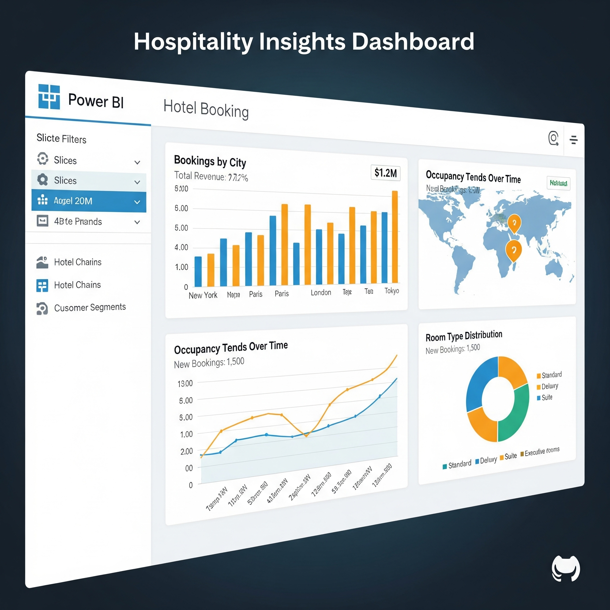

<h1 align="center">Hey there 👋, I'm Vikas Kumar</h1>
<h3 align="center">🚀 Aspiring Data Analyst | SQL & Power BI Enthusiast | Passionate About Turning Raw Data into Business Insights</h3>

  

---

## 🧑‍💻 About Me

I'm a passionate and detail-oriented **Data Analyst** with a proven ability to derive actionable insights from data. With a strong foundation in **SQL**, **Python**, **Power BI**, and **Excel**, I transform complex datasets into interactive dashboards, business reports, and visual stories.

### ✅ Key Competencies:
- 🔍 Data Cleaning | Data Transformation | Data Wrangling (Python, SQL)
- 📊 Dashboard Development using Power BI & Excel
- 🧠 Statistical Analysis | Exploratory Data Analysis (EDA)
- 📈 Business Intelligence (BI) & Reporting
- 🤖 Real-World Projects in Marketing, Finance, HR, and Retail Analytics

> 💡 *"Driven by data. Powered by insights. Focused on results."*

---

## 🛠 Tools & Technologies

**Core Tech Stack:**  
  
  
  
  
  
  
  

---

## 📜 Professional Certifications Portfolio

### 🎓 IBM Data Analyst Professional Certificate  
**Platform:** Coursera | **Date:** Aug 2024  
**Key Learning Tracks:** Python for Data Science, SQL, Excel, Data Visualization, Dashboards  
✅ Hands-on labs with real-world datasets & capstone projects  
🔗 [View Credential](#)

---

### 🧠 Microsoft & LinkedIn – Career Essentials in Data Analysis  
**Date:** July 2024  
**Focus:** Fundamentals of Business Intelligence & Data Visualization  
🔗 [View Credential](#)

---

## 🧪 Virtual Internships – Case-Based Learning (Forage)

These real-world case simulations helped me apply my skills to solve real business problems:

- **Accenture North America** – Data Cleaning, Power BI Visualization  
- **PwC Switzerland** – Customer Retention Analysis (Power BI)  
- **Deloitte** – Forensic Data Analysis (Fraud Analytics)  
- **Tata Group** – Communicating Data with Clarity & Design Thinking  

📂 Repo: [Professional Certifications](https://github.com/vikasgit101/professional-certifications)

---

## 🚀 Featured Projects

Here are some of the real-world projects I've worked on — focused on deriving insights, building dashboards, and solving business problems using SQL, Python, Power BI, and Excel.

### 📊 HR Analytics Dashboard – Excel

  

> **Tools:** Excel, Pivot Tables, Charts  
> **Summary:** HR metrics analysis – headcount, attrition, average age & diversity trends.

---

### 🏦 Banking Client Insights – Power BI

  

> **Tools:** Power BI, Excel  
> **Summary:** Client segmentation, retention pattern analysis, and business relationships.

---

### 🚴‍♂️ Bike Buyers Dashboard – Excel

  

> **Tools:** Excel  
> **Summary:** Customer behavior insights based on demographic segmentation and bike purchase trends.

---

### 🛍️ Walmart Diwali Sales – SQL + Python

  

> **Tools:** SQL, Python (Pandas, Matplotlib)  
> **Summary:** Campaign performance insights from regional festive sales data.

---

### 💳 Loan Approval Prediction – Machine Learning

  

> **Tools:** Python, Pandas, Scikit-learn  
> **Summary:** ML classification model predicting loan approval based on applicant features.

---

### 🏨 Hospitality Insights Dashboard – Power BI

  

> **Tools:** Power BI  
> **Summary:** Analyzes guest satisfaction, booking behavior & service feedback in the hospitality sector.

---

🔗 View all my projects in the [Repositories Tab »](https://github.com/vikasgit101?tab=repositories)

---

## 💼 Why This Portfolio Matters

- ✅ Demonstrates practical expertise in data manipulation and visualization  
- ✅ Validates continuous learning through global certifications  
- ✅ Reflects real-world problem solving via internship simulations  
- ✅ Tailored for entry-level to junior-level data analyst roles

---

## 📫 Let’s Connect

📧 Email: [vk328696@gmail.com](mailto:vk328696@gmail.com)  
🔗 LinkedIn: [linkedin.com/in/vikasku](https://linkedin.com/in/vikasku)

---

## 📣 Relevant Keywords

**Keywords (SEO Optimized):**  
`Data Analyst Portfolio`, `SQL Data Analysis`, `Power BI Dashboards`, `Python for Data Science`, `Excel Reports`, `EDA Projects`, `Business Intelligence`, `Data Visualization`, `Capstone Projects`, `Internship Case Studies`, `Job-Ready Data Analyst`, `Real-world Data Projects`, `Certification in Analytics`, `Data Storytelling`, `Junior Data Analyst Resume`

---

## 🔖 Hashtags (For LinkedIn & GitHub Discovery)

`#DataAnalytics` `#SQL` `#Python` `#PowerBI`  
`#BusinessIntelligence` `#DataVisualization` `#IBMDataAnalyst`  
`#MicrosoftCertified` `#ForageInternships` `#CareerEssentials`  
`#DataPortfolio` `#RealWorldProjects` `#JobReadySkills`  
`#GitHubPortfolio` `#DataStorytelling` `#AnalyticsCareer`

---

> _“Certification proves commitment. Projects prove application. I’m proud to have both!”_

