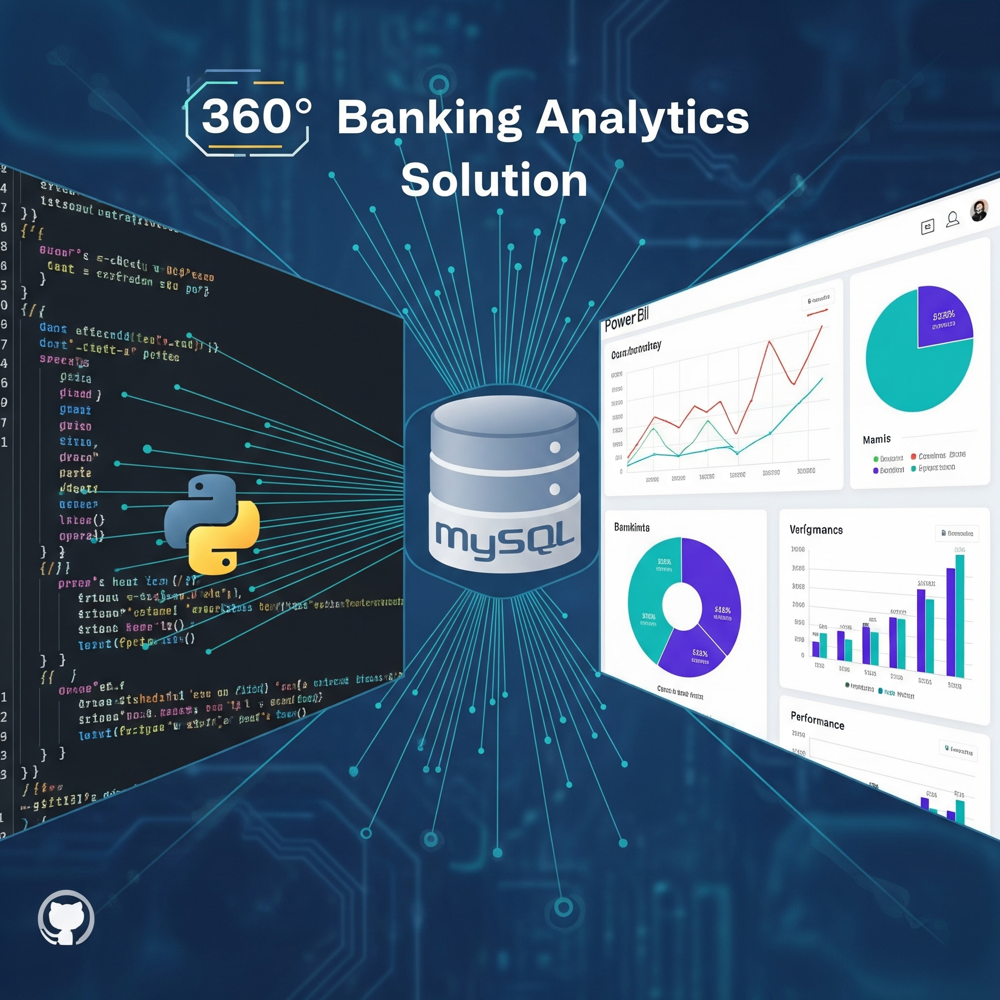

<h1 align="center">Vikas Kumar</h1><h3 align="center">Data Analyst | Business Intelligence & Reporting Specialist | SQL, Python, Power BI</h3>

âš¡ Executive SummaryDetail-oriented and results-driven Data Analyst with proven expertise in transforming raw data into actionable business insights. Highly proficient in SQL, Python (Pandas/NumPy), Power BI, and Advanced Excel. Possessing a robust portfolio of real-world projects across Marketing, Finance, and HR, validated by the IBM Data Analyst Professional Certificate. Dedicated to leveraging statistical analysis and visualization to drive data-informed decision-making and business growth. Seeking a challenging role to apply strong technical acumen and continuous learning.🯠Core Competencies & Technical SkillsThis section is optimized for recruiters, focusing on quantifiable skills and knowledge depth.Data Analysis & Modeling: Expert in Exploratory Data Analysis (EDA), statistical analysis, and data wrangling using Python (Pandas, NumPy) and advanced SQL (window functions, joins, complex queries).Business Intelligence (BI): Proficient in designing and developing interactive reports and high-fidelity dashboards using Power BI and Advanced Excel (Pivot Tables, advanced formulas) to monitor key performance indicators (KPIs).Data Storytelling: Skilled in creating clear, compelling visual narratives to communicate complex findings to non-technical stakeholders.Project Portfolio: Successfully executed 10+ real-world case studies and projects, including HR Attrition Analysis, Banking Client Segmentation, and Loan Approval Prediction (ML model), showcasing end-to-end data analysis workflow.Tools & Technologies: SQL, Python, Power BI, Advanced Excel, Tableau, Git.🛠 Tech StackCore Tech Stack:📜 Professional Certifications & Experience📠IBM Data Analyst Professional CertificatePlatform: Coursera | Date: Aug 2024Focus: Comprehensive mastery of Python, SQL, Excel, and Data Visualization for end-to-end data analysis.✅ Hands-on labs with real-world datasets & capstone projects🔗 View Credential🧠 Microsoft & LinkedIn – Career Essentials in Data AnalysisDate: July 2024Focus: Fundamentals of Business Intelligence, Data Visualization principles, and effective communication strategies.🔗 View Credential🧪 Virtual Internships – Case-Based Learning (Forage)These real-world case simulations helped me apply skills in a corporate context:Accenture North America: Data Cleaning and Power BI Visualization.PwC Switzerland: Customer Retention Analysis using Power BI to inform strategy.Deloitte: Forensic Data Analysis and Fraud Analytics techniques.Tata Group: Communicating Data with Clarity & Design Thinking.📂 Repo: Professional Certifications🚀 Featured ProjectsShowcasing diverse technical application in business context.📊 HR Analytics Dashboard – Excel

> Tools: Excel, Pivot Tables, Charts> Impact: Developed a dynamic dashboard tracking headcount, attrition rates, and diversity trends to support strategic HR planning.🦠Banking Client Insights – Power BI

> Tools: Power BI, Excel> Impact: Performed detailed client segmentation and retention pattern analysis, identifying key customer segments for targeted marketing initiatives.💳 Loan Approval Prediction – Machine Learning

> Tools: Python, Pandas, Scikit-learn> Impact: Built and evaluated an ML classification model to predict loan approval, enhancing risk assessment accuracy.💼 Portfolio Value PropositionPractical Expertise: Demonstrates comprehensive, practical expertise in end-to-end data manipulation and visualization.Validated Skills: Continuous learning validated through global industry-recognized certifications.Business Acumen: Reflects real-world problem-solving capabilities via structured internship simulations.Career Readiness: Portfolio tailored for entry-level to junior-level data analyst roles, proving job-readiness.📫 Let’s Connect📧 Email: vk328696@gmail.com🔗 LinkedIn: linkedin.com/in/vikasku🌠GitHub: github.com/vikasgit101🔖 Keywords (SEO Optimized)Data Analyst Portfolio, SQL Data Analysis, Power BI Dashboards, Python for Data Science, Business Intelligence, Data Visualization, IBM Data Analyst, Job-Ready Skills, Analytics Career

